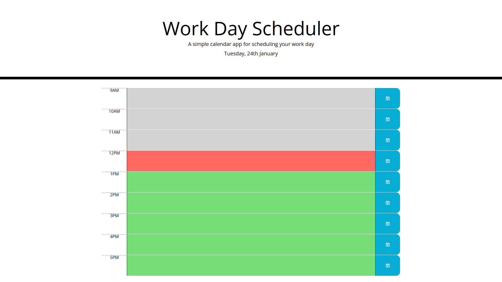
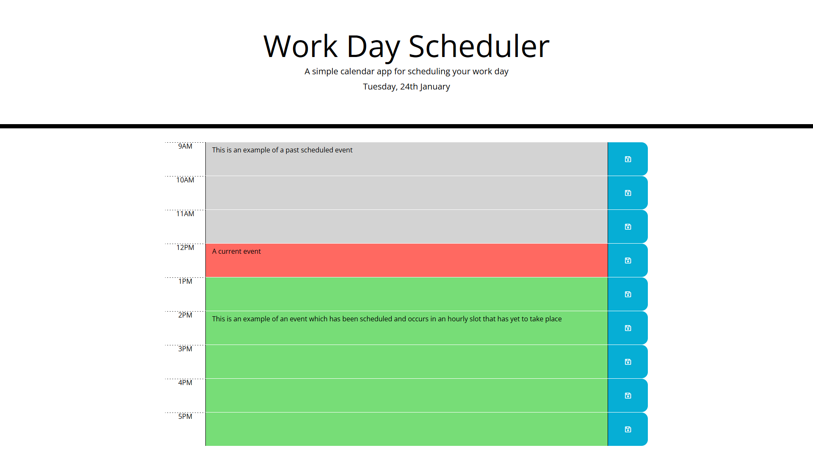

# daily-schedule-planner

## Table of Contents
1. [URL](#url)
2. [Description](#description)
3. [Installation](#installation)
4. [Usage](#usage)
5. [Credits](#credits)

## URL 

A live version of this page has been deployed at
https://spacepineapple.github.io/daily-schedule-planner/

## Description 

This page was created as my solution to the seventh challenge task of a web
development bootcamp. For this task, I was provided with starter code including
the HTML layout for a basic webpage containing a heading and an empty container,
as well as the CSS styling for the page. My task was to create the JavaScript
code to create a work day scheduling page. The challenge carried a number of
criteria and restrictions on how the page should look and act. These included:

1. The page must display the current day at the top of the calender when a user opens the planner.
2. The page must present timeblocks for standard business hours when the user scrolls down.
3. The timeblocks in the schedule must be colour coded based on past, present, and future when the timeblock is viewed.
4. The page must allow a user to enter an event when they click a timeblock.
5. The page must allow the user to save the event in local storage when the save button is clicked for that timeblock.
6. The events in the calendar must persist between refreshes of the page.

On first opening index.html or loading the live version of the page, a user
should see the start screen roughly as follows. Note that depending on the time
that the page is viewed, individual hourly slots will display in either green,
red or grey whether they are in the future, present or past relative to the
current time.

A user may click on any of the coloured timeblocks and add text describing their
schedule. The image below displays examples of schedule text of varying length
in past, present and future timeslots.

Please note that clicking on the blue save buttons will save these schedule
descriptions to your browser's local storage. As a result, any saved schedule
events will also be loaded when subsequently accessing the page. The appearance
of the page after this has been performed will therefore be variable and depend
on any content which the user has added to the page.

## Installation 

All of the required files are included in this repository and no installation
should be required. The index.html file should render in any modern browser on
both a desktop or mobile device. 

## Usage 

This page should load in any modern browser. To use the scheduler, simply open
the schedule page and click in any of the text areas -- these will be the grey,
red and green coloured areas between the hour labels and the blue save buttons.
Having clicked inside these areas, you should be able to add a description of
your schedule within the text area. Following this, clicking on the save button
should save any scheduled events to your browser's local storage. Please note
that as a result, if this page is opened in private browsing/incognito mode,
scheduled events will not be saved.

## Credits 

The JavaScript code contained in the script.js file was written entirely by
myself. However, for this challenge we were provided with all of the content in
the index.html and style.css files. The content in those files was provided by
edX as part of their Front End Web Development bootcamp. In addition, this
project makes use of the Bootstrap framework and JQuery library for which I can
take no credit.